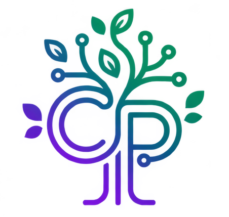

  

<h1 align="center">
  
</h1>

<h3 align="center">Full Stack Java Jr </h3>

  
  
  
  
  

---

## 💫 Sobre Mí

Desarrolladora **Full Stack** con enfoque en **Java** y **Spring Boot**. Ingeniera Mecánica que aplica pensamiento sistémico para escribir código limpio y escalable.

Apasionada por construir aplicaciones de principio a fin, conectando la lógica del backend con interfaces atractivas e interactivas en el frontend. Disfruto resolver y estructurar problemas, trabajar en equipo y mantenerme en aprendizaje continuo.

- 🌎 Ubicada en **Bogotá, Colombia**
- 💼 Buscando mi primer rol como **Backend** o **Full Stack Developer**
- ☕ Fan incondicional del **café** (∞ tazas y contando)
- ✈️ Me encanta **viajar**, el cine y la **Inteligencia Artificial**

---

## 🛠️ Tech Stack

### Backend

### Frontend

### Tools & DevOps

### Data & Analytics

---

## 🚀 Proyectos Destacados

| Proyecto | Descripción | Tech Stack | Demo | Repo |
|---|---|---|---|---|
| **🐾 AgendaPets** | Plataforma fullstack para gestión de reservas de peluquería canina. Cuenta con panel de admin, roles, JWT y CRUD completo. | `Java 17` · `Spring Boot` · `PostgreSQL` · `JS` · `Bootstrap` | [Ver Demo](https://agenda-pets-pi.vercel.app/) | [Backend](https://github.com/AgendaPets/Backend_AgendaPets) |
| **💼 Coworking API** | API REST robusta para gestionar sedes, categorías y espacios coworking con operaciones CRUD completas. | `Java` · `Spring Boot` · `PostgreSQL` | — | [Ver Código](https://github.com/CarolPinerosTrujillo/Coworking_API_Java) |
| **✅ PlannerAPP CP** | Gestor de tareas con filtros por estado, CRUD y persistencia. Backend desarrollado en Java + Spring Boot. | `HTML` · `CSS` · `JS` · `Bootstrap` · `Spring Boot` | [Ver Demo](https://carolpinerostrujillo.github.io/Web_planificadorTareas/) | [Ver Código](https://github.com/CarolPinerosTrujillo/Web_planificadorTareas) |
| **🌻 Huerta Hayuelos** | Sitio web informativo para huerta comunitaria: historia, compostaje, cultivos y actividades comunitarias. | `HTML` · `CSS` · `JavaScript` | [Ver Demo](https://carolpinerostrujillo.github.io/HuertaComunitaria/) | [Ver Código](https://github.com/CarolPinerosTrujillo/HuertaComunitaria) |
| **🌮 La Fiesta Mexicana** | Landing page creativa para restaurante fusión mexicano-colombiano. Incluye carrito, menú dinámico y diseño responsivo. | `HTML` · `CSS` · `JS` · `Bootstrap` · `SweetAlert2` | [Ver Demo](https://carolpinerostrujillo.github.io/Hackaton-Landingpage-LaFiestaMex/) | [Ver Código](https://github.com/CarolPinerosTrujillo/Hackaton-Landingpage-LaFiestaMex/) |
| **🛰️ API NASA (GEN_NASA_API)** | Consumo y visualización de APIs de NASA. Proyecto colaborativo enfocado a integrar datos espaciales en UI interactiva. | `HTML` · `CSS` · `JavaScript` | [Ver Demo](https://sebasrincon10.github.io/GEN_NASA_API/) | Colaborativo |

---

## 📊 Estadísticas de GitHub

  
  

  

---

## 💡 Frase que me define

> _"De la ingeniería mecánica al software: Diseño el futuro un commit a la vez. 🚀"_

---

  

